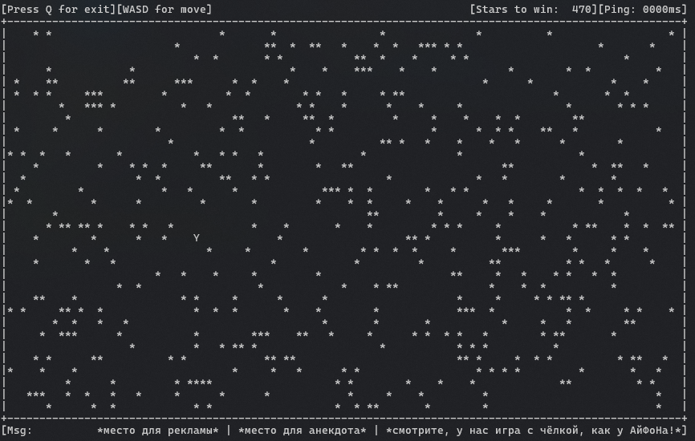
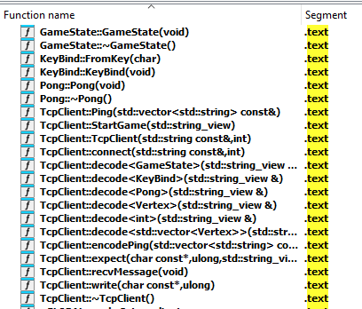
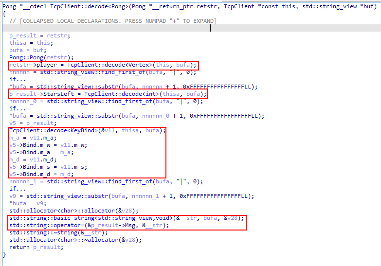
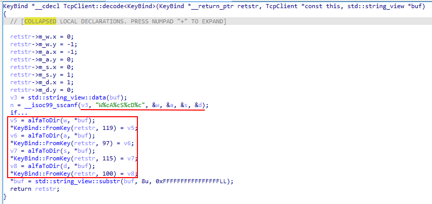
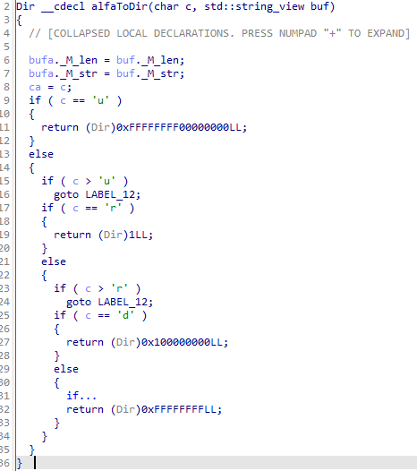
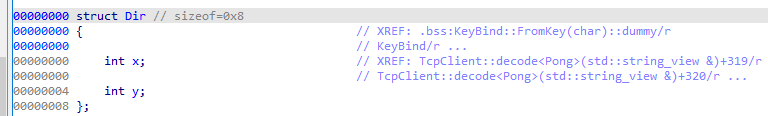
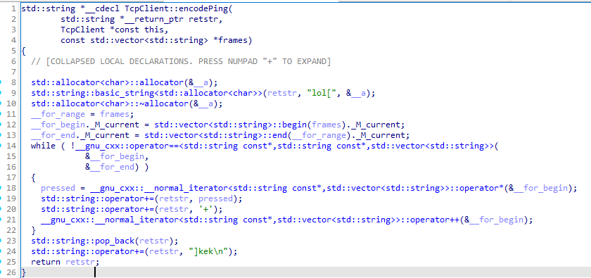

# Непослушный мотоцикл

## Описание

> Вы берёте водный мотоцикл, чтобы с ветерком прокатиться. Заводите мотор и через пару секунд понимаете: что-то не так. Поворачиваете влево — вас несёт вправо, хотите сбавить скорость — а транспорт разгоняется. Мотоцикл словно живёт своей жизнью. Нужно срочно разобраться с управлением, пока вы не уплыли к соседнему острову или какой-нибудь удачливой акуле...
>
> Ваш водный мотоцикл: [jetski/give](give/)
>
> Запуск: ./jetski-game jetski-455wf7wv.alfactf.ru 30036 <token>


# Write up

Перед нами консольный таск-игра:  


Можем перемещаться с помощью WASD, но начиная с первой звезды кнопки меняет направления.

## Трафик

Если слушать трафик, то будет такой стрим:
```sh
⇒ <token>
⇐ lol{69,17}|{105,32}|[{11,13}+{62,30}+..+{88,23}+{5,23}]kek
...
⇐ lol{76,17}|457|WuAdSlDr|kek
⇒ lol[w+w+w++++]kek
⇐ lol{76,14}|457|WuAdSlDr|kek
⇒ lol[++++++]kek
⇐ lol{76,14}|457|WuAdSlDr|kek
⇒ lol[++++++]kek
⇐ lol{76,14}|457|WdAuSlDr|kek
⇒ lol[+a]kek
⇐ lol{76,13}|456|WdAuSlDr|kek
⇒ lol[++++++]kek
⇐ lol{76,13}|456|WdAuSlDr|kek
⇒ lol[++++a+a+a]kek
⇐ lol{76,10}|455|WlArSuDd|kek
⇒ lol[a+a+a+a+a]kek
⇐ lol{81,10}|454|WlArSuDd|kek
⇒ lol[a+a+a+a+a+a]kek
⇐ lol{87,10}|453|WlAdSrDu|kek
⇒ lol[a+a]kek
⇐ lol{87,12}|452|WlAdSrDu|kek
⇒ lol[a+a+a+a+a+a+a]kek
⇐ lol{87,19}|452|WlAuSrDd|kek
⇒ lol[a+a+++++]kek
⇐ lol{87,17}|452|WlAuSrDd|kek
```

потенциально можно распарсить глазами, но лучше пойти в IDA и пореверсить протокол.

## Реверс

Как удачно, что таск разделён на два бинаря:
1. `jetski-game` - таск самой игры
2. `libnetworking.so` - либа с протоколом

Засунув либу, отсортировав и отфильтровав только функции с кодом, можно увидеть не сильно много функций.  


Отчетливо видно Ping, Pong, GameState и функции декода/енкода.  

### Pong

Посмотрим декод понга:  


В рамках - это декод полей: позиции игрока, количество оставшихся звездочек, бинды кнопок и сообщение, поля разделены прямой чертой `|`.  
Сопоставим с понгом от сервера: `lol{87,12}|452|WlAdSrDu|kek`:
- `{87,12}` - позиция
- `452` - звездочки
- `WlAdSrDu` - биндинги, можно догадаться (или посмотреть в асм), что:
  - `Wl` - кнопка `W` - движение влево
  - `Ad` - кнопка `A` - движение вниз
  - и т д
- ` ` - пустое сообщение

Можно ещё больше убедиться, что биндинг понимается правильно:

Тут парсится строчка:  


`alfaToDir` - это матч буквы в Dir:  
  
здесь IDA отображает два 32 битных инта, как одно 64 битное число, причём IDA отображает в big-endian.  

Вот структура `Dir`.


В итоге получается:  
- `u` - {0, -1}
- `r` - {1, 0}
- `d` - {0, 1}
- `l` - {0, -1}

### Ping

Пинг тоже не выглядит сложным:



Принимаем вектор строк и конкатенируем их через `+`. Исходя из трафика, строки - это нажатые кнопки.

## Все вместе

Имеем игру, которая постоянно пингует перемещения и получает текущий статус.  
Каждое сообщение начинается с `lol` и заканчивается `kek`.  

Пишем сплоит, который:
1. Переместиться в угол
2. Построчно пылесосить звезды

Посмотрим, что будет в конце.  
А в конце флаг:
```sh
⇒ lol[S+S+S+S+S+S+S]kek
⇐ lol{27,31}|0|WdArSlDu|alfa{J3T_5k1_mAk3S_vr0Om_Vr0om_Vr00M_vROoM}kek
```