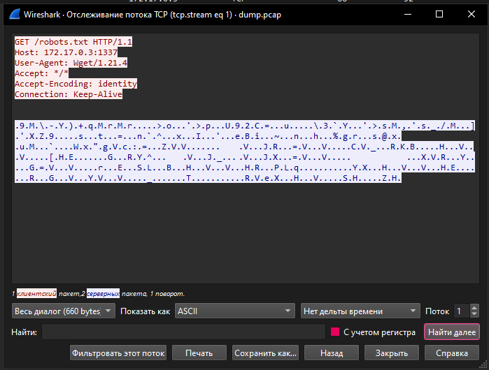
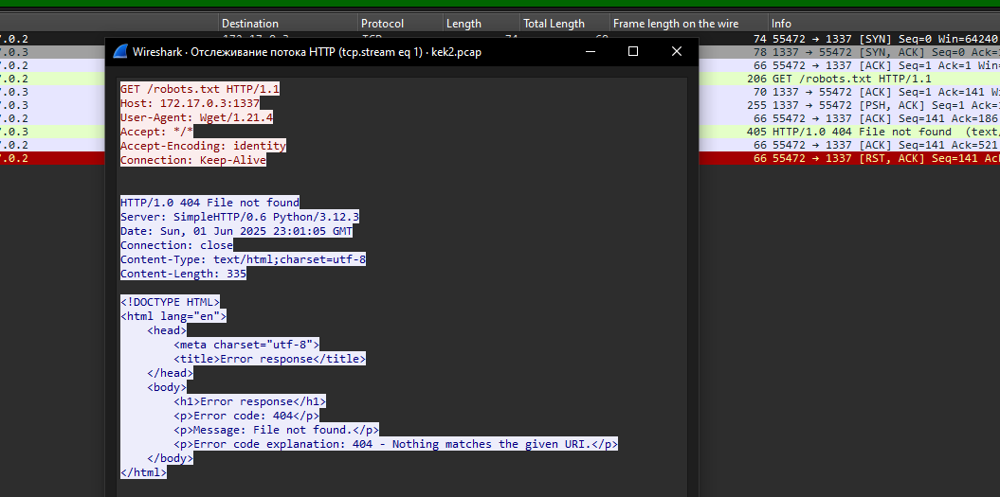
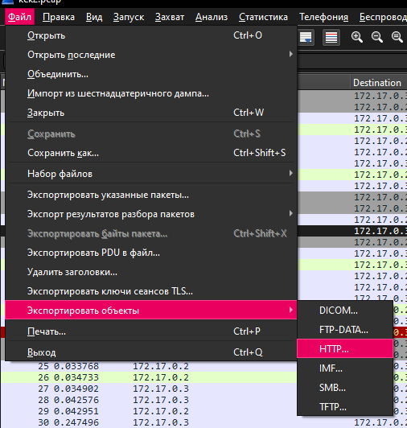
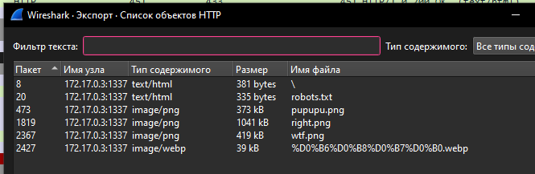

# Неприкосновен­ный запас

## Описание

> На острове переполох: исчезли все мемы! Говорят, кто-то их скачал и не залил обратно.  
> Последний неприкосновенный запас мемов записан тут: dump.pcap — но он шифрован вот этой программой: found_tc_program.o
>
> Верните мемы, пока сёрф-клуб не погрузился в пучину уныния.
>

# Write up

## Дано

Нам дали ebpf код и трафик.

Трафик выглядит примерно так:  


Выден запрос и виден ответ, но он зашифрован.

### Реверс

Самая трудная часть. Бинарь без дебаг символов, а значит придётся смотреть глазами.

Тут можно смотреть через радар, гидру или что-то, что поддерживает eBPF VM.  
У всех тулов есть нюансы, я обычно смотрю через `llvm-objdump -S` ([вот тут](images/disasm.s) лежит выхлоп, без байтов смотреть лучше).

> [!NOTE]  
> Сначала хотелось показать в радаре, но ebpf плагин не умеет показывать прыжки наверх. Из-за этого смотреть больно.

#### Выход

Данный блок кода - это просто выход из ebpf
```asm
0000000000000148 <LBB0_7>:    ; return -1
      41:    r0 = 0xffffffff ll

0000000000000158 <LBB0_18>:   ; retrun r0
      43:    exit
```
эквивалент на си:
```c
return -1;
```
Все прыжки на `LBB0_7` или `LBB0_18` - это выход. В регистре `r0` - возвращаемое значение.  
https://www.ietf.org/archive/id/draft-thaler-bpf-isa-00.html#name-registers-and-calling-conve

#### Вызов хелперов

В ebpf можно вызывать хелперфункции, это выглядит так:
```
call 0x1a
```
конкретно это вызов `bpf_skb_load_bytes`, все хелпер функции пронумерованы с единицы. Их все можно посмотреть тут: https://github.com/libbpf/libbpf/blob/master/src/bpf_helper_defs.h.

Все используемые хелперы:
- 0x7 = 7: [`bpf_get_prandom_u32`](https://docs.ebpf.io/linux/helper-function/bpf_get_prandom_u32/)
- 0x9 = 9: [`bpf_skb_store_bytes`](https://docs.ebpf.io/linux/helper-function/bpf_skb_store_bytes/)
- 0x1a = 26: [`bpf_skb_load_bytes`](https://docs.ebpf.io/linux/helper-function/bpf_skb_load_bytes/)
- 0x26 = 38: [`bpf_skb_change_tail`](https://docs.ebpf.io/linux/helper-function/bpf_skb_change_tail/)

Немного фактов о вызовах:
- Аргументы передаются через регистры r1-r5, максимум 4 аргумента.
- Для eBPF хелперов первым аргументом является аргумент-контекст. Он же передаётся в ebpf программу тоже первым аргументом.
- регистр r10 указывает на стек
- https://www.ietf.org/archive/id/draft-thaler-bpf-isa-00.html#name-registers-and-calling-conve.

Из вызовов уже можно сванговать, что программа что-то шифрует и меняет размер пакета.

#### Парсинг пакета

Первые 40 инструкций - это парсинг пакета. Сначала *езернет*, потом *ip*, затем *tcp* - это можно понять из вызовов `bpf_skb_load_bytes`, контекста - указатель на буффер пакета, оффсета относительно начала пакета и длин данных.

В конце проверка на порт 1337:
```asm
      38:    if r1 == 0x3905 goto +0x5 <LBB0_8>       ; if r1 == 1337 then .main_work
      39:    r1 = *(u16 *)(r10 - 0x36)
      40:    if r1 == 0x3905 goto +0x3 <LBB0_8>       ; if r1 == 1337 then .main_work
```

За `LBB0_8` скрывает логика модификации пакета, а на 41 инструкции уже выход.

#### Обработка пакета

Первым делом идёт расширение пакета на 4 байта:
```asm
      46:    r2 = *(u32 *)(r6 + 0x0)      ; skb->len
      47:    r2 += 0x4        ; len
      48:    r1 = r6          ; skb
      49:    r3 = 0x0         ; flags
      50:    call 0x26        ; call bpf_skb_change_tail(skb, len=(skb->len+4), flags=0)
```
Сейчас в `r6` хранится контекст, а контекст у eBPF traffic control программ - это [`struct __sk_buff`](https://elixir.bootlin.com/linux/v6.15.1/source/include/uapi/linux/bpf.h#L6250), по офсету `0x0` лежит поле `len`.  
Если не удалось, то eBPF программа выйдет с кодом 2 - это DROP пакета.

Дальше генерируется рандом, сейчас он будет лежать на стеке `r10 - 0x38`:
```asm
      63:    call 0x7         ; call bpf_get_prandom_u32(void)
      64:    r8 = r0
      65:    *(u32 *)(r10 - 0x38) = r8    ; var_38 = <r0>
```

Регистр `r8` далее будет использован как "текущий ключ".

#### Шифрование

Цикл состоит из блоков:
- `LBB0_11` - основное тело цикла
- `LBB0_16` - действие после цикла

##### Load

Чтение 4х (`r4`) байт по оффсету `r7` в переменную на стеке `r10-0x24`.
```asm
      79:    r3 = r10         ; to
      80:    r3 += -0x24      ; to
      81:    r1 = r6          ; skb
      82:    r2 = r7          ; offset
      83:    r4 = 0x4         ; len
      84:    call 0x1a        ; call bpf_skb_load_bytes(skb, offset=<r7>, to=&var_24, len=4)
      85:    r1 = 0x0
      86:    if r1 s> r0 goto +0x29 <LBB0_15>   ; if r0 < 0 then return 2
```

Если не получилось (`r0 < 0`), то дропаем пакет в ветке `LBB0_15`.

##### XOR

Чтение 4х байт пакета со стека `r10-0x24`, текущий ключ в регистре `r8`, XOR значений и запись обратно в переменную `r10-0x24`.
```asm
      ; var_24 ^= <r8>  ; <r8>=current key
      87:    r9 = *(u32 *)(r10 - 0x24)
      88:    r9 ^= r8
      89:    *(u32 *)(r10 - 0x24) = r9
```

##### Store

Пишем в пакет, по прежнему оффсету `r7` из стека `r10-0x24` длиной 4 байта.
```asm
      90:    r3 = r10         ; from
      91:    r3 += -0x24      ; from
      92:    r1 = r6          ; skb
      93:    r2 = r7          ; offset
      94:    r4 = 0x4         ; len
      95:    r5 = 0x0         ; flags
      96:    call 0x9         ; call bpf_skb_store_bytes(skb, offset=<r7>, from=&var_24, len=4, flags=0)
      97:    r1 = 0x0
      98:    if r1 s> r0 goto +0x1d <LBB0_15>   ; if r0 < 0 then return 2
```

Если получилось, то идём дальше, иначе дропаем пакет.

##### Инкремент счётчика

Сначала происходит проверка на выход из цикла. В `r3` восстанавливает текущий счетчик итераций и проверяется на граничное значение в `r10-0x48`, в котором лежит размер пейлоада в 32 битных словах (можно проследить инициализацию значения и дойти до ip header'а).

```asm
      ; var_40 &= (1 << 32 - 1)
      99:    r3 = *(u64 *)(r10 - 0x40)
     100:    r1 = r3
     101:    r1 <<= 0x20
     102:    r1 >>= 0x20

     103:    r2 = *(u64 *)(r10 - 0x48) ; var_48
     104:    if r1 >= r2 goto +0x8 <LBB0_16>    ; if var_40 >= var_48 then .footer
```

Также есть счётчик `r7` - используется как оффсет в байтах. Вот они инкрементятся:
```asm
     107:    r3 += 0x1
     108:    r7 += 0x4
```

В конце итерации есть дополнительая проверка на границу в 2000 слов (то есть максимум 800 байт):
```asm
     111:    r2 = 0x7d0
     112:    if r2 > r1 goto -0x23 <LBB0_11>    ; if r2 > r1 then .loop_body_11
```

А затем в самом начале цикла `r3` сохранится на стек:
```asm
0000000000000270 <LBB0_11>:               ; .loop_body_11
      78:    *(u64 *)(r10 - 0x40) = r3    ; var_40=<r3>
```


##### Мутация ключа

В конце итреации происходит ещё мутацию ключа:
```asm
     105:    r8 *= -0x7789843f         ; <r8> *= 0x88767bc1 ; <r8> = current key * 0x88767bc1
     106:    r9 ^= r8                  ; <r9> ^= r8         ; <r9> = <r8> ^ crypted
     ; ...
     109:    r9 *= 0x20763841          ; <r9> *= 0x20763841 ; <r9> *= 0x20763841
     110:    r8 = r9                   ; <r8> = <r9>        ; current key = ((current key * 0x88767bc1) ^ crypted) *= 0x20763841
```
Текущий ключ умножается на 32 битное число `0x88767bc1`, затем XOR с тем, что только что *зашифровали*, далее снова умножается на `0x20763841`.  
Результат манипуляций - новый ключ, используемый в следующей итерации.  

#### Сохранение ключа

Ветка `LBB0_16` - последний блок программы, он сохраняет ключ из переменной `r10-0x38` по оффсету `r10-0x58`.  
Оффсет компилятором зачем-то был разделен на стековую переменную и `r8`, вычисляемую из `r9` и оригинальной длины. Если проследить все махинации, то будет понятно, что функция запишет ключ в конец пакета.

```asm
     113:    r1 = *(u64 *)(r10 - 0x50)
     114:    r2 = *(u64 *)(r10 - 0x58)
     115:    r2 += r1         ; offset
     116:    r3 = r10         ; from
     117:    r3 += -0x38      ; from
     118:    r7 = 0x0
     119:    r1 = r6          ; skb
     120:    r4 = 0x4         ; len
     121:    r5 = 0x0         ; flags
     122:    call 0x9         ; call bpf_skb_store_bytes(skb, offset=(var_50+var_58), from=&var_38, len=4, flags=0)
```


### Дешифруем трафик

Итого что делает программа:
1. для пакетов с портом 1337 шифруется трафик
2. для каждого пакета рандомится 4 байтовый рандом - ключ
3. цикл по всему TCP пейлоаду
    1. чтение текущий 4х байт, XOR с ключом и запись обратно
    2. мутация ключа
4. ключ хранится в последних 4 байтах

Берём scapy и пишем примерно такую программу: [sploit.py](sploit/sploit.py) - 
ходим по всем пакетам, берём пакеты с src портом 1337, достаём ключ, дешифруем, удаляем ключ и обновляем пейлоад. Затем формируем новый дамп.

Теперь видим сырой HTTP ответ:  


Экспортируем объекты:  


Смотрим мемы:  


И сдаём флаг из `right.png`.